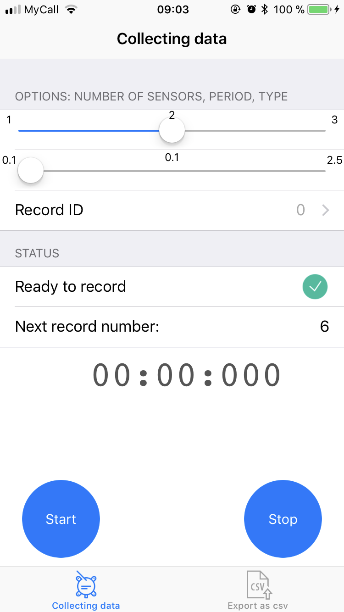
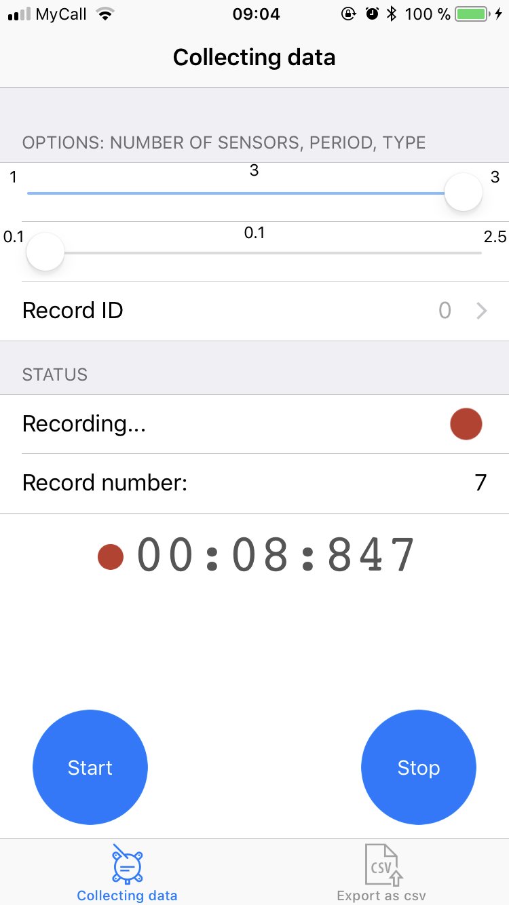

# DataCollector
iOS app for collecting data (gyroscope, magnetometer, accelometer) from SensorTag 2.0 (CC2650).

After loading, the app tries to find selected amount of sensors. First sensor gets red LED light, second - green, third - 
red and green.

  

This needs to know from which exactly sensor the app records data and to juxtapose in future that information
with data in *.csv-file. It is also possible to adjust period and choose type of record. After recording, 
all the sessions could be exported into *.csv-file.

# Screenshots

  
  
  
  

